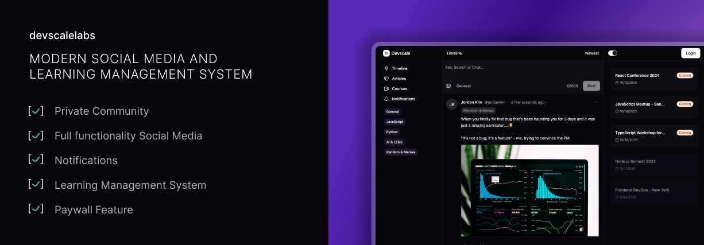

# BetterLMS

> A modern Social Media + Learning Management System for creators to build private communities

[](https://opensource.org/licenses/MIT)
[](https://www.typescriptlang.org/)
[](https://reactjs.org/)
[](https://hono.dev/)

[!IMPORTANT] This project is still in development and not ready for production use.

## Overview

BetterLMS combines social media with LMS features for content creators to engage communities, share knowledge, and deliver education.

### Key Features

- **Social Media**: Timeline feed, posts, likes, comments, profiles, mentions, notifications
- **Learning**: Articles, courses, channels, enrollment
- **Community**: Roles (Admin, Mentor, User), moderation, analytics
- **Admin**: Dashboard, user/content management

## Architecture

Monorepo with microservices:

```
betterlms/
├── apps/ (admin, api, platform, worker)
├── packages/ (common, core, database, email, storages, ui)
└── tooling/
```

## Tech Stack

- **Frontend**: React 19, TypeScript, Vite, Tailwind CSS, Radix UI, TanStack Query
- **Backend**: Hono, TypeScript, Prisma, PostgreSQL, JWT, bcrypt
- **Infra**: AWS S3, SMTP, pnpm

## Quick Start

### Prerequisites
- Node.js 18+, pnpm, PostgreSQL, AWS S3, SMTP

### Setup
1. Clone: `git clone https://github.com/devscalelabs/betterlms.git && cd betterlms`
2. Install: `pnpm install`
3. Env: Copy `.env.example` and configure
4. DB: `pnpm db:generate && pnpm db:migrate && pnpm seed:all` (optional)
5. Dev: `pnpm dev`

## Project Structure

- `apps/`: Admin, API, Platform, Worker
- `packages/`: Database, UI, Core, Email, Storages, Common
- `tooling/`: Scripts, TypeScript configs

## Development

Scripts: `pnpm dev`, `pnpm api:dev`, etc.
Database: `pnpm db:migrate`, `pnpm db:studio`
Code: Biome for formatting/linting

## Security

JWT auth, bcrypt hashing, CORS, Zod validation, Prisma ORM.

## Database

PostgreSQL with entities: Users, Posts, Channels, Articles, Media, Likes, Follows.

## Deployment

Build: `pnpm --filter api build` etc.
Configure env vars for production.

## Contributing

Not accepting external contributors. For issues, fork for personal use.

## License

Licensed under MIT - see [LICENSE](LICENSE).

## Acknowledgments

Built with modern tech, inspired by community learning needs.
